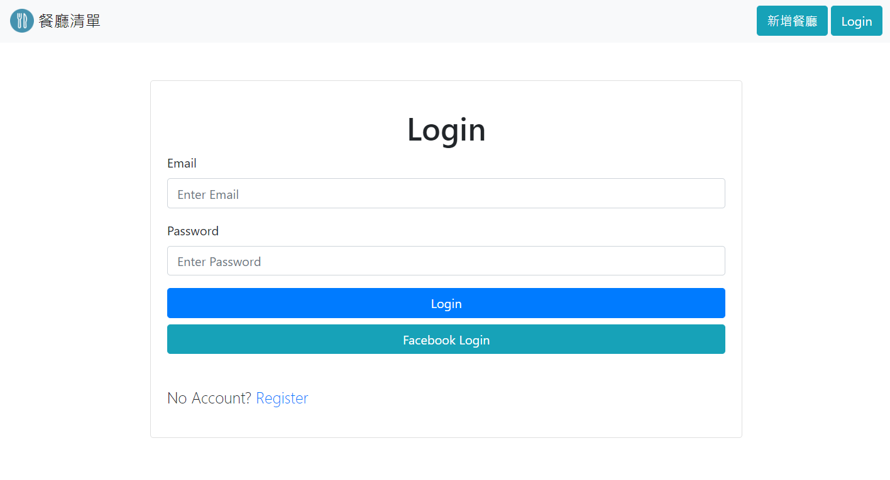
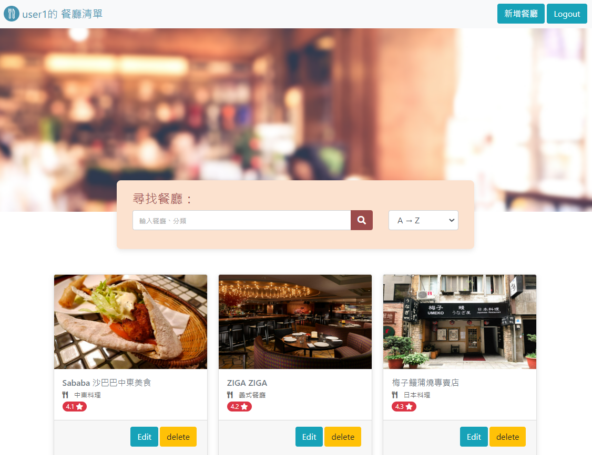
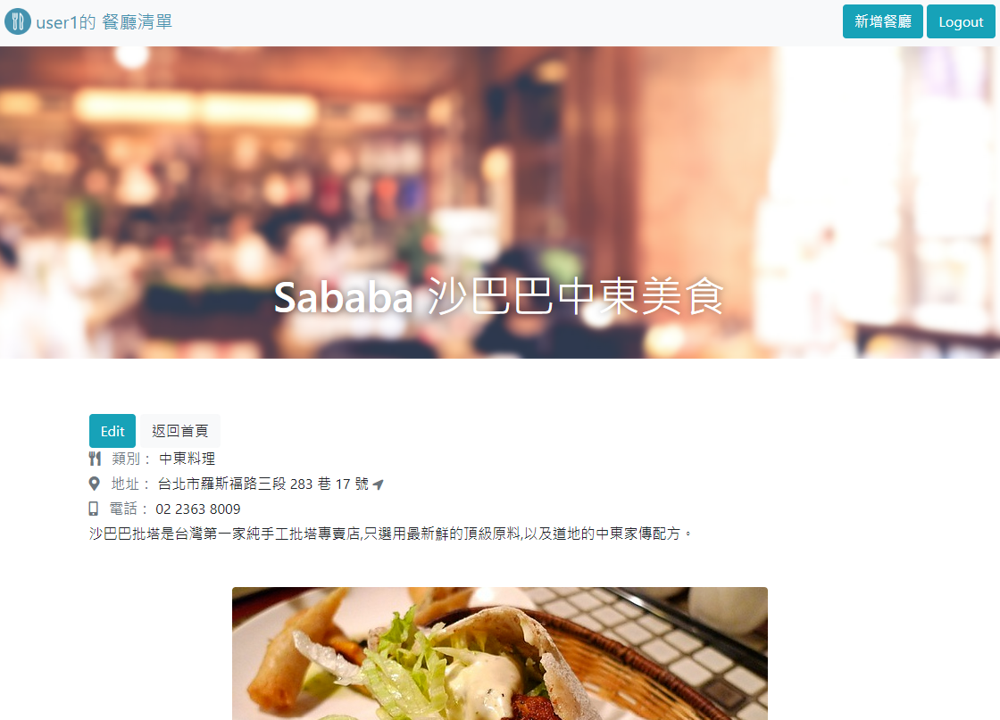

# 我的餐廳清單

## 介紹

來建立屬於你自己的餐廳清單吧

### 功能

- 使用者可以註冊帳號或是用 Facebook 登入
- 使用者登入後可以建立屬於自己的餐廳清單，資訊包含餐廳名稱/圖片/類型/評分/Google 地圖連結等...
- 使用者可以新增/刪除/修改/查詢餐廳資訊

## 專案畫面

#### 登入



#### 首頁



#### 詳細資料



## 開始使用

1. 請先確認有安裝 node.js 與 npm
2. 將專案 clone 到本地
3. 在本地開啟之後，透過終端機進入資料夾，輸入：

   ```bash
   npm install // 安裝套件
   ```

4. 建立.evn 檔案，參考.env.example 以設置環境變數

   ```
   FACEBOOK_ID=SKIP
   FACEBOOK_SECRET=SKIP
   FACEBOOK_CALLBACK=http://localhost:3000/auth/facebook/callback
   SESSION_SECRET=ThisIsMySecret
   MONGODB_URI="Your MONGODB connection string"
   PORT=3000
   ```

5. 寫入種子資料

   ```bash
   npm run seed
   ```

6. 開啟程式

   ```bash
   npm run start
   ```

7. 若看見此行訊息則代表順利運行，打開瀏覽器進入到以下網址

   ```bash
   Restaurant List is now listening on http://localhost:3000
   ```

   請至 http://localhost:3000 開啟網站

8. 可以使用下列兩個種子資料進行測試

   ```bash
   User1
   email: user1@example.com
   password: 12345678

   -------------------------

   User2
   email: user2@example.com
   password: 12345678
   ```

9. 若欲中斷伺服器連線，請按

   ```bash
   ctrl + c
   ```

## 開發工具

- Node.js 16.16.0
- Express 4.18.1
- Mongoose 6.6.5
- Express-Handlebars 3.0.0
- bcryptjs 2.4.3
- connect-flash 0.1.1
- dotenv 8.2.0
- express-session 1.17.3
- method-override 3.0.0
- passport 0.4.1
- Bootstrap 4.3.1
- Font-awesome 5.8.1

## 開發人員

Wei Lin
